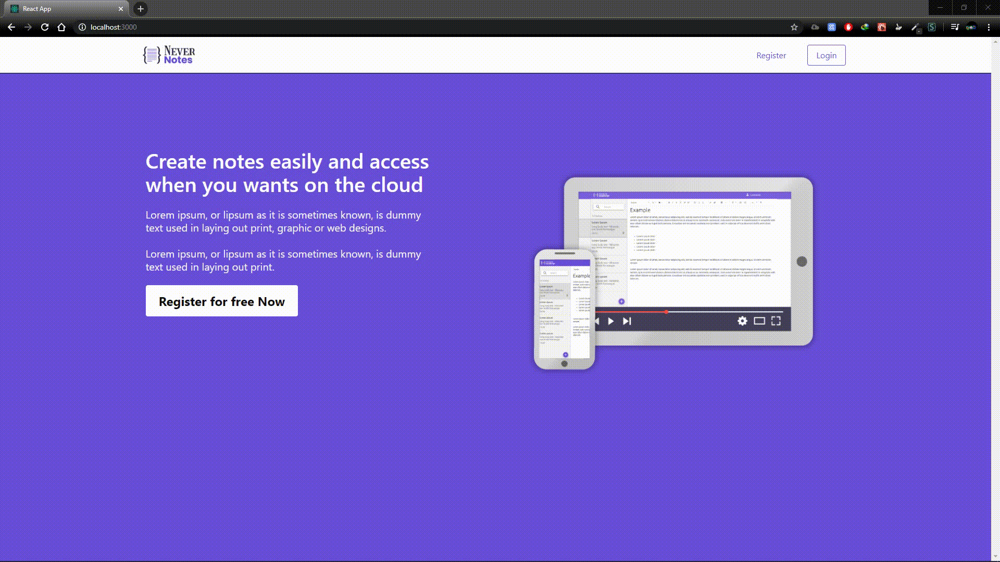

<h1 align="center">NeverNotes</h1>

<h3 align="center">Clone do EverNote</h3>



#### Como iniciar

Entre na pasta ```nevernotes``` e na ```nevernotes_api``` e rode ```yarn install```. Quando todas as dependencies estiverem instaladas, rode yarn start em cada uma das pastas. 

obs: Necessário ter o mongodb instalado
